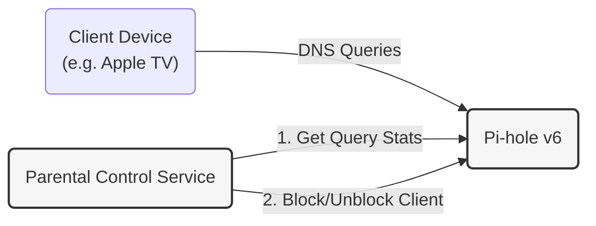

# Pi-hole Parental Control

## Motivation
The Apple TV doesn't have a way to properly block YouTube based on time watched. This feature is useful to limit kids' time spent in front of the TV. This App integrates with Pi-hole (v6 and newer) and, based on the DNS query history, blocks DNS queries for the specified client when the limit is reached.

## Idea
Go service that:
- Periodically checks statistics.
- Checks every 1 minute for YouTube (or any other service) related queries.
- If the counter is greater than the limit -> block the client.
- Sends voice notifications via [simple-google-speaker](https://github.com/Vladikamira/simple-google-speaker) when the limit is approaching and when it's reached.
- Resets the counter at midnight.

Domains for other services/web sites can be found here: https://github.com/v2fly/domain-list-community/blob/master/data

## How it works

1. **Client Setup**: Devices (like an Apple TV or iPad) must have their DNS settings manually configured to point to the Pi-hole IP address. This ensures all internet requests go through Pi-hole first.
2. **Monitoring**: The `pihole-parental-control` service connects to the Pi-hole API (v6) and periodically checks the query logs for specific domains (e.g., YouTube).
3. **Enforcement**:
   - It calculates the total time spent watching based on query frequency.
   - Once the configured limit (e.g., 2 hours) is reached, the service instructs Pi-hole to **block** those domains for that specific client.
   - It also triggers a voice message on Google Cast devices via the `simple-google-speaker` service.
   - At midnight, the counter resets, and domains are unblocked automatically.

> [!IMPORTANT]
> **Disclaimer**: Since this application works based on counting DNS requests, measurements may not be perfectly accurate. Factors like DNS caching, background activity, or pre-fetching can affect the results.



## Requirements

- **Pi-hole v6 or newer**: This application relies on the new API introduced in Pi-hole v6. It will **not work** with Pi-hole v5.x.

## Usage

### Configuration

The application is configured via environment variables:

| Variable | Description | Example |
|----------|-------------|---------|
| `PIHOLE_ADDRESS` | Address of your Pi-hole instance | `http://192.168.1.10` |
| `PIHOLE_PASSWORD` | Your Pi-hole admin password | `secretpassword` |
| `TELEGRAM_BOT_TOKEN` | Telegram Bot Token for notifications | `123456:ABC-DEF1234ghIkl-zyx57W2v1u123ew11` |
| `TELEGRAM_CHAT_ID` | Chat ID where notifications will be sent | `123456789` |
| `DAYLY_WATCHING_LIMIT` | Daily watching limit (default: 1h) | `2h`, `1h30m` |
| `SPEAKER_URL` | URL of the `simple-google-speaker` service | `http://192.168.1.50:8080` |
| `SPEAKER_LANGUAGE` | Language for voice messages (default: `en`) | `ru`, `en` |
| `SPEAKER_NEAR_LIMIT_MESSAGE` | Voice message when < 5 mins left | `Wrap it up.` |
| `SPEAKER_LIMIT_REACHED_MESSAGE` | Voice message when limit reached | `Time is up.` |

### Run via Go

To run the application locally using Go:

```bash
export PIHOLE_ADDRESS="http://192.168.1.10"
export PIHOLE_PASSWORD="your_password"
export TELEGRAM_BOT_TOKEN="your_bot_token"
export TELEGRAM_CHAT_ID="your_chat_id"
export DAYLY_WATCHING_LIMIT="1h"

go run cmd/main.go
```

### Run via Docker

#### Docker Run

```bash
docker run -d \
  --name pihole-parental-control \
  -e PIHOLE_ADDRESS="http://192.168.1.10" \
  -e PIHOLE_PASSWORD="your_password" \
  -e TELEGRAM_BOT_TOKEN="your_bot_token" \
  -e TELEGRAM_CHAT_ID="your_chat_id" \
  -e DAYLY_WATCHING_LIMIT="2h" \
  vladikamira/pihole-parental-control
```

#### Docker Compose

Create a `docker-compose.yml` file:

```yaml
services:
  pihole:
    image: pihole/pihole:development-v6
    container_name: pihole
    ports:
      - "53:53/tcp"
      - "53:53/udp"
      - "80:80/tcp"
    environment:
      - FTLCONF_webserver_api_password=your_secret_password
    restart: unless-stopped

  parental-control:
    image: vladikamira/pihole-parental-control:latest
    container_name: pihole-parental-control
    restart: unless-stopped
    depends_on:
      - pihole
    environment:
      - PIHOLE_ADDRESS=http://pihole:80
      - PIHOLE_PASSWORD=your_secret_password # Must match FTLCONF_webserver_api_password
      - TELEGRAM_BOT_TOKEN=your_bot_token
      - TELEGRAM_CHAT_ID=your_chat_id
      - DAYLY_WATCHING_LIMIT=2h
```

Then run:

```bash
docker compose up -d
```
